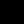

<!-- # Hi there , I'am **Divyanshu Tyagi** -->
<h1 align="center">Hi 👋, I'm Divyanshu Tyagi! :stars:</h1>

<!--**github2python/github2python** is a ✨ _special_ ✨ repository because its `README.md` (this file) appears on your GitHub profile. -->

   
    
    
    
    
       
    
        

## About Me
- Hey there! :smile: I'm a Divyanshu Tyagi. A `Full Stack Developer` 🚀 from India. 
- I'm currently an undergraduate pursuing my bachelor's in CSE from `IIT (ISM) Dhanbad`.
- I am a passionate programmer competing across different competitive programming platforms.
- I am keenly interested in `Web Development, Machine Learning, and Cloud computing`. 
- I love exploring evolving technologies and constantly strive to improve my technical competency.
- I am a very curious person and always try to find opportunities. 
- I'm always looking to work with people who are interested in creating and working on cool, interesting, and meaningful projects!

    
    
    

    

